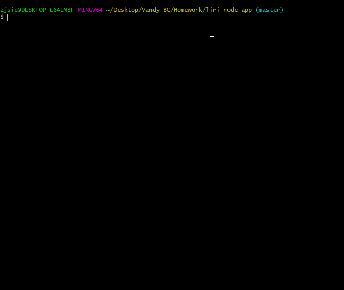
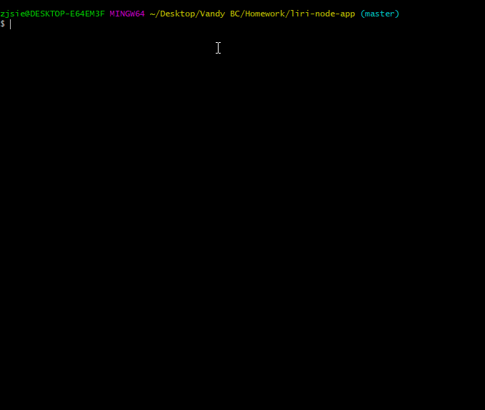

# Liri-Node-App

Liri Bot is a command line node app that takes in parameters for bands, songs, movies and returns the information the user searched for. Similar to the well know application "Siri"!

***
Use the command line to to run Liri Bot
<li>Find a song: spotify-this-song (_insert song) -- This command will pull the Artists, Song Name,  Preview Link and Album Title.</li> 
    

<li>Find a band's concert info: concert-this (_insert band) -- This command will pull the Name of the Venue, Venue Location and Concert Date.</li> 
    
    
<li>Find a movie's info: movie-this (_insert movie title) -- This command will pull the Title, Release Year, Rating, IMDB Rating, Rotten Tomatoes Rating, Country the Country Was Produced, Language, Plot and the Main Actors/Actresses.</li> 
    
    
<li>Have Liri respond to what is in the text file: do-what-it-says -- This command will pull whatever command is in the random.txt file.</li> 
    

***
Technologies used:
- OMDB, BandsinTown, Spotify API's
- Node
- Switch and Case statements
- Colors npm for some basic styling 
- With no html to link the project to, added gifs to show how the application runs. 

*** 
Future Development

- I would like to create a tutorial video explaining the game.
- Create a log.txt file so you can append and log previous searches. 
- Add more styling to the command line. 
- Add a still frame for the gifs.
